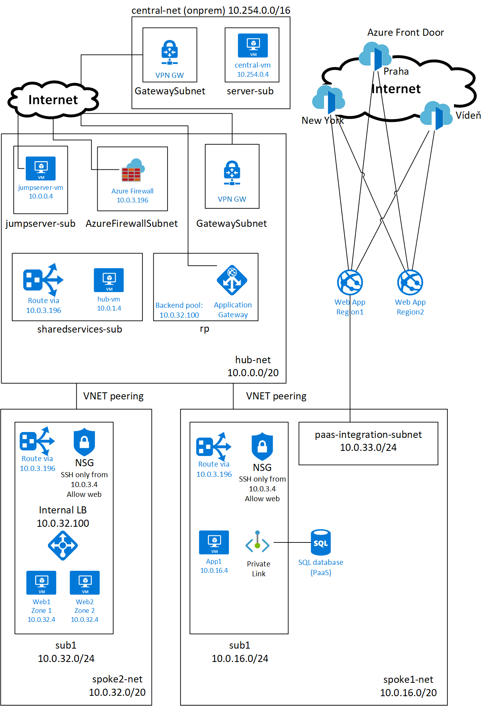

# Introduction to Azure Networking - lab

This lab (guide.sh) will guide you throw creation of enterprise networking environment in Azure including:
* VNETs and subnets
* Hub-and-spoke topology with VNET peering
* Load balancing
* Network Security Groups
* Using jump server to enhance security
* VPN connectivity to on-premises
* Firewall/router to filter traffic between spokes and access Internet (Azure Firewall od 3rd party option)
* IaaS to PaaS integration via Azure Firewall or 3rd party routing/firewall (using Linux router)
* IaaS to PaaS direct integration via Service Endpoints
* Deploying reverse proxy (and WAF) in HA to securely expose apps to Internet using Azure Application Gateway or 3rd party solution (NGINX)
* Using ARM templates for automation

Folow instructions in guide.sh and use your name and pod number assigned by instructor.
Instructor will use central.sh to deploy simulation of on-premises environment.

# ARM template to quickly build complete demo
If you do not want to build environment yourself step by step, but rather need to deploy complete solution in one step, use ARM templates in ArmEnv folder or click Deploy to Azure button here:

There are couple of parameters you can use to tweek your environment such as whether you want native components such as Azure Firewall and Azure Application Gateway or deploy solution using 3rd party components (represented by Linux VMs with iptables and NGINX).

# Network diagram

# Tests after environment is deployed
Connect to jump server on its public ip.

## Check you can access app1 VM only via jump server (NSG)
ssh tomas@10.0.16.4 (should work)
ssh tomas@10.0.1.4 (go to hub vm) -> ssh tomas@10.0.16.4 (should fail)

## Check app1 talks to outside of VNET via firewall
ssh tomas@10.0.16.4 -> curl www.microsoft.com vs. curl www.google.com (for Azure Firewall)
or connect to 3rd party appliance (10.0.3.4) and run tcpdump to check packets going throw

curl 10.0.32.4 (check access from app1 to web1)
It goes over firewall (sudo apt update && sudo apt install traceroute -y && sudo traceroute -T 10.0.32.4
)

## Test load balancer
curl 10.0.32.4
curl 10.0.32.5
curl 10.0.32.100 (try multiple times to show responses from different servers)

## Check web farm is exposed via reverse proxy
Obtain reverse proxy public IP (IP of App Gateway or public IP of LB in front of 3rd party VMs)
curl publicip:8080

## Test IaaS to PaaS secure connection via Service Endpoint
Make sure you are not able to access your SQL server from jump server or your laptop over Internet. SQL server name is generated and it will be different in your case:

sqlcmd -S tomas-dbsrv-bl5uwshgpcmcw.database.windows.net -U tomas -P Azure12345678

It should be possible from app1 VM due to service endpoint.
ssh tomas@10.0.16.4 (jump to app1) 
sqlcmd -S tomas-dbsrv-bl5uwshgpcmcw.database.windows.net -U tomas -P Azure12345678

## Check connection to onpremises resource
from jump server
ssh tomas@10.254.0.4

## Check PaaS (App Service) to VNET integration
Open globalwebregion1 WebApp and click on console
From PaaS check connectivity to VMs in VNET:
tcpping 10.0.0.4:22

# Presentation in Czech
[https://github.com/tkubica12/azure-networking-lab/blob/master/img/enterpriseNetworkingPPT_CZ.pdf](https://github.com/tkubica12/azure-networking-lab/blob/master/img/enterpriseNetworkingPPT_CZ.pdf)